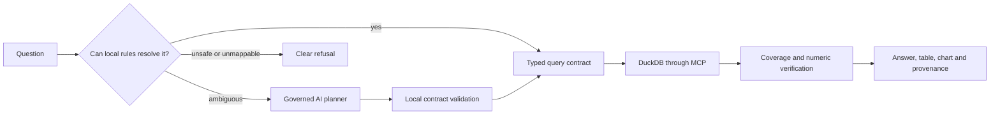

# Agentic Analytics Engine

Ask a question about a built-in warehouse or an uploaded CSV/Parquet file.
The engine turns the question into a bounded analytical contract, executes
that contract locally over DuckDB, verifies the result, and shows the data
and SQL behind every published number.

**Live demo:** [agentic-analytics-engine.onrender.com](https://agentic-analytics-engine.onrender.com/)

This is not a model that writes SQL and narrates whatever comes back. For the
canonical upload path, a model may propose a typed interpretation, but local
code validates it, compiles and executes the SQL, constructs the answer and
verifies every number. The richer multi-task warehouse path may use models to
propose findings and judge semantic support; deterministic arithmetic,
evidence and policy gates can still withhold them. A model never executes SQL
or calculates an analytical value.

## What makes it governed



- **Contracts are typed and local.** Operations, measures, groupings, filters,
  periods, rankings and result shape are checked before SQL is composed.
- **Execution is deterministic.** The engine owns the SQL, read-only guard,
  metric definitions, statistics, chart specification and arithmetic checks.
- **Publishing fails closed.** A claim needs cited cells, numeric support,
  evidence support and question relevance. A complete breakdown is never
  presented as complete unless coverage was measured.
- **Provenance is first-class.** Reports link each number to the snapshot,
  cited cells, generated SQL and applied contract.

Read the full [architecture](docs/ARCHITECTURE.md), the visual
[architecture atlas](docs/architecture-atlas/README.md), and the
[limitations](docs/LIMITATIONS.md) for the boundaries this project does not
claim to solve.

## Ways to run an analysis

**Governed Analysis** is the normal product path. It resolves straightforward
questions locally at no model cost and consults an AI planner only for an
eligible ambiguity. The route is recorded; it is never inferred by the UI.

Two explicit audit paths are also available when the deployment enables them:

| Path | Purpose | What can spend money |
| --- | --- | --- |
| Deterministic Analytics | Inspect the rule-based interpretation | Nothing leaves the server |
| AI Analytics | Inspect the cloud-assisted path | One typed planning request for canonical uploads; the richer warehouse workflow may make multiple bounded model calls |
| Compare planning strategies | Run the deterministic and AI planning paths over one dataset | The AI side only |

Comparison does not rank planners. It says whether the accepted contracts,
coverage and outputs agree, and identifies the differing contract fields when
they do not.

## Upload analytics

Uploaded files are handled as a separate, bounded capability:

- CSV and Parquet only; one file per anonymous, capability-based session.
- The public deployment applies file, column, row, rate and concurrency
  limits. Sessions and their DuckDB data expire; they are isolation, not user
  accounts.
- The engine infers conservative column roles. Unsupported questions and
  incomplete results refuse instead of silently dropping a filter, grouping or
  period.
- A cloud planner sees the question, schema information and allowed aggregate
  labels, not unaggregated uploaded rows. A near-unique text column is withheld
  from grouping because group labels may reach a remote planner.

### When the data cannot settle a column's role

Some numeric columns are structurally ambiguous: a value from 18–65 might be
an ordered quantity such as age, or a numeric key such as store number. The
engine marks that as a close call rather than pretending it knows.

For an ambiguous upload field, the session owner may confirm **quantity** or
**category**. That confirmation is scoped to that upload session, validated
server-side, revisioned to reject stale browser tabs, recorded in the planning
audit, and pinned when a run starts. It never rewrites a completed run's
historical evidence. Confirming a quantity permits an average, not an
automatic total: additivity is a different fact the engine still does not
know.

The implementation and trade-offs are in
[ADR 0007](docs/adr/0007-session-scoped-role-confirmation.md).

## Run locally

```bash
make bootstrap  # create the environment and install Python/npm dependencies
make data       # generate the deterministic demo warehouse
make dev        # build and serve http://127.0.0.1:8000 in fake-provider mode
make verify     # run the same family of checks CI runs
```

Normal development commands pin `AAE_PROVIDER_MODE=fake`; they do not need a
credential or make a provider request. The browser suite also refuses to run
unless the server health endpoint reports `provider_mode: fake`.

Cloud development is deliberately separate and requires explicit intent:

```bash
AAE_CONFIRM_PAID_LOCAL_RUN=1 make dev-cloud
```

That command can make billed requests. Do not use it for ordinary tests.

## Stack and boundaries

| Concern | Implementation |
| --- | --- |
| Web client | React, TypeScript, Vite and Vega-Lite |
| API and live events | FastAPI and SSE |
| Analytical workflow | LangGraph, typed state and an MCP client/server boundary |
| Calculation | DuckDB, a semantic metric layer and SciPy where a supported test applies |
| Safety | AST-based SQL guard, locked read-only DuckDB, bounded uploads and capability sessions |
| AI assistance | Typed planning proposals validated locally; shared usage ledger when cloud mode is enabled |
| Deployment | Docker on Render; optional external key-value store for governed usage accounting |

The website uses MCP in-process; `/mcp` is a separately guarded Streamable
HTTP transport for external callers and is withdrawn on the public deployment.

## Verification evidence

Test counts change as the suite grows, so this introduction does not freeze
them. CI publishes the count for the exact commit it checks and reconciles
every discovered browser test, declared skip and retry across Chromium,
Firefox and WebKit.

The production audit on 6 October 2026 checked the exact deployed commit:

- all ten CI jobs, including Docker and the three browser engines, passed;
- the credential-free API acceptance script passed 60 checks;
- the hosted browser sweep passed 156 of 156 width, theme and state cells and
  made no upload, analysis, comparison or provider request; and
- one separately authorised Compare canary passed 41 checks and cost
  **$0.000158**.

These are engineering checks, not a claim of universal dataset coverage or
WCAG conformance. See the [production audit](docs/RELEASE-EVIDENCE-production-2026-10-06.md),
the [historical release evidence](docs/RELEASE-EVIDENCE-v0.1.0.md), and the
[limitations](docs/LIMITATIONS.md). The [documentation map](docs/README.md)
separates current operating material from historical evidence.

## Repository map

```text
src/agentic_analytics/
  analytics/       contracts, semantic inference, execution and presentation
  api/             FastAPI, SSE, sessions, uploads and admission
  graph/           workflow state and orchestration
  llm/             fake, local and governed cloud-provider adapters
  mcp_layer/       analytical MCP tools, resources and client transport
  verification/    arithmetic, claim-shape, evidence and chart safety
  warehouse/       DuckDB lifecycle, metrics, SQL guard and session capability
web/               React application, report workspace and browser tests
docs/              ADRs, architecture, evidence, deployment notes and limits
```

## Honest limits

- It does not establish causal claims, forecasts, arbitrary joins or business
  semantics that are absent from the data.
- Schema inference is conservative, not omniscient. A role confirmation is a
  user-supplied interpretation, not a fact inferred from values.
- The scripted provider validates engine behaviour; it is not evidence of
  real-model planning quality. Paid live-model checks are documented
  separately and are intentionally limited.
- Session capability is not authentication, and application rate limits are
  not a provider billing guarantee.

See the complete [limitations](docs/LIMITATIONS.md). MIT licensed.
