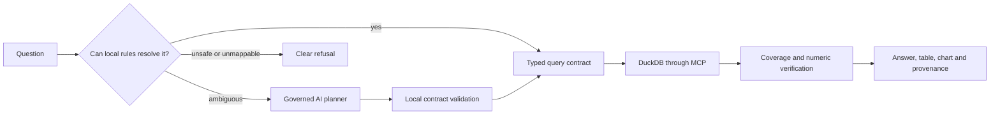

# Agentic Analytics Engine

Ask a question about a built-in warehouse or an uploaded CSV/Parquet file. The
engine compiles the question into a typed analytical contract, executes that
contract locally over DuckDB, verifies the result, and shows the data and SQL
behind every published number.

**Live demo:** [agentic-analytics-engine.onrender.com](https://agentic-analytics-engine.onrender.com/)

A model never executes SQL and never calculates a published value. On the
upload path a model may propose a typed interpretation of an ambiguous
question; local code then validates that proposal against the schema,
compiles the SQL, runs it, and re-checks every figure. The multi-task
warehouse path may also use models to propose findings and judge semantic
support, and deterministic arithmetic, evidence checks and policy gates can
still withhold them.

## How a question becomes an answer



The rule resolver returns one of five states: `EXACT`, `AMBIGUOUS`,
`UNRESOLVED`, `UNSUPPORTED`, `UNSAFE`. Only `AMBIGUOUS` can reach a planner,
and only for the four issues a model can plausibly settle from wording:
an unclear column role, competing measure candidates, competing dimension
candidates, and an unbound filter. Everything else refuses with a reason and
makes no provider request.

Period ambiguity is deliberately excluded from that set. A signup date beside
annual revenue cannot establish which column is the business clock for the
measure, so the engine asks the session owner instead of guessing.

Both paths hold to the same four properties:

- Operations, measures, groupings, filters, periods, rankings and result
  shape are all validated before any SQL is composed.
- The engine owns the SQL, the read-only guard, metric definitions,
  statistics, chart specification and arithmetic checks.
- A published claim needs cited cells, numeric support, evidence support and
  question relevance. A breakdown is described as complete only where
  coverage was measured.
- Reports link each number to its snapshot, cited cells, generated SQL and
  accepted contract.

Full detail in [architecture](docs/ARCHITECTURE.md), the
[architecture atlas](docs/architecture-atlas/README.md), and
[limitations](docs/LIMITATIONS.md).

## Ways to run an analysis

**Governed Analysis** is the default. It resolves straightforward questions
locally at no model cost and consults a planner only for an eligible
ambiguity. The route taken is recorded by the server rather than inferred by
the UI.

Two audit paths are available where the deployment enables them:

| Path | Purpose | What can spend money |
| --- | --- | --- |
| Deterministic Analytics | Inspect the rule-based interpretation | Nothing leaves the server |
| AI Analytics | Inspect the cloud-assisted path | One typed planning request for canonical uploads; the warehouse workflow may make several bounded model calls |
| Compare planning strategies | Run both planning paths over one dataset | The AI side only |

Comparison does not rank planners. It reports whether the accepted contracts,
coverage and outputs agree, and names the differing contract fields where they
do not.

## Upload analytics

- CSV and Parquet only, one file per anonymous capability-based session.
- The public deployment applies file, column, row, rate and concurrency
  limits. Sessions and their DuckDB data expire; they provide isolation
  rather than user accounts.
- Column roles are inferred conservatively. Unsupported questions and
  incomplete results refuse rather than silently dropping a filter, grouping
  or period.
- A cloud planner receives the question, schema information and allowed
  aggregate labels, never unaggregated rows. A near-unique text column is
  withheld from grouping, because group labels can reach the planner.

### When the data cannot settle a column's role

Some numeric columns are structurally ambiguous: a value between 18 and 65
could be an ordered quantity such as age or a numeric key such as a store
number. The engine marks this as a close call.

For an ambiguous upload field the session owner may confirm **quantity** or
**category**. That confirmation is scoped to the session, validated
server-side, revisioned to reject stale browser tabs, recorded in the planning
audit, and pinned when a run starts. It never rewrites a completed run's
evidence. Confirming a quantity permits an average but not an automatic total,
because additivity is a separate fact the engine still does not know.
Rationale in [ADR 0007](docs/adr/0007-session-scoped-role-confirmation.md).

## Run locally

```bash
make bootstrap  # create the environment, install Python and npm dependencies
make data       # generate the deterministic demo warehouse
make dev        # build and serve http://127.0.0.1:8000 in fake-provider mode
make verify     # lint, types, both test suites and recordings
```

Development commands pin `AAE_PROVIDER_MODE=fake` and need no credential. The
browser suite refuses to run unless the target is a loopback address whose
health endpoint reports `provider_mode: fake`. It checks the host as well as
the mode, because the deployment also runs in fake mode: `provider_mode`
selects the ungoverned provider, while the paid path is gated separately on an
enabled flag, a credential and a reachable usage ledger. Deployments are
exercised by the hosted sweep in `web/hosted/`, which has its own gate.

Cloud development requires explicit intent and can bill a real account:

```bash
AAE_CONFIRM_PAID_LOCAL_RUN=1 make dev-cloud
```

## Stack and boundaries

| Concern | Implementation |
| --- | --- |
| Web client | React, TypeScript, Vite and Vega-Lite |
| API and live events | FastAPI and SSE |
| Analytical workflow | LangGraph, typed state, an MCP client/server boundary |
| Calculation | DuckDB, a semantic metric layer, SciPy where a supported test applies |
| Safety | AST-based SQL guard, locked read-only DuckDB, bounded uploads, capability sessions |
| AI assistance | Typed planning proposals validated locally; a shared usage ledger when cloud mode is on |
| Deployment | Docker on Render, with an optional key-value store for usage accounting |

The website speaks MCP in-process, so it makes no network hop for tools.
`/mcp` is a separately guarded Streamable HTTP transport for external callers,
and it answers 503 when no Host allow-list is configured, which is how the
public deployment runs.

## Verification evidence

CI publishes the test count for the exact commit it checks, and reconciles
every discovered browser test, declared skip and retry across Chromium,
Firefox and WebKit, so no count is frozen here.

The production audit on 6 October 2026 checked the deployed commit:

- all ten CI jobs passed, including Docker and the three browser engines;
- the credential-free API acceptance script passed 60 checks;
- the hosted browser sweep passed 156 of 156 width, theme and state cells and
  made no upload, analysis, comparison or provider request;
- one separately authorised Compare canary passed 41 checks and cost
  **$0.000158**.

These are engineering checks. They are not a claim of universal dataset
coverage or WCAG conformance. See the
[production audit](docs/RELEASE-EVIDENCE-production-2026-10-06.md),
[historical release evidence](docs/RELEASE-EVIDENCE-v0.1.0.md) and
[limitations](docs/LIMITATIONS.md). The [documentation map](docs/README.md)
separates current operating material from historical evidence.

## Repository map

```text
src/agentic_analytics/
  analytics/       contracts, semantic inference, execution and presentation
  api/             FastAPI, SSE, sessions, uploads and admission
  graph/           workflow state and orchestration
  llm/             fake, local and governed cloud-provider adapters
  mcp_layer/       analytical MCP tools, resources and client transport
  verification/    arithmetic, claim-shape, evidence and chart safety
  warehouse/       DuckDB lifecycle, metrics, SQL guard and session capability
web/               React application, report workspace and browser tests
docs/              ADRs, architecture, evidence, deployment notes and limits
```

## Limits

- No causal claims, forecasts, arbitrary joins, or business semantics absent
  from the data. Schema inference is conservative, and a role confirmation
  records a user-supplied interpretation rather than a fact derived from
  values.
- The scripted provider validates engine behaviour, not real-model planning
  quality. Paid live-model checks are documented separately and deliberately
  few.
- A session capability provides isolation, not authentication, and
  application rate limits are not a provider billing guarantee.

Complete list in [limitations](docs/LIMITATIONS.md). MIT licensed.
