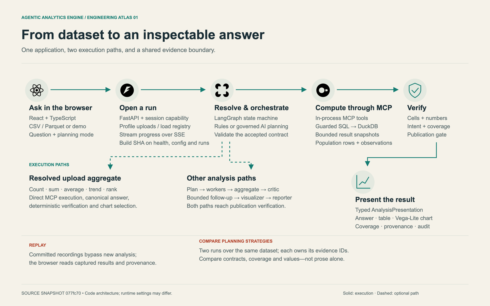
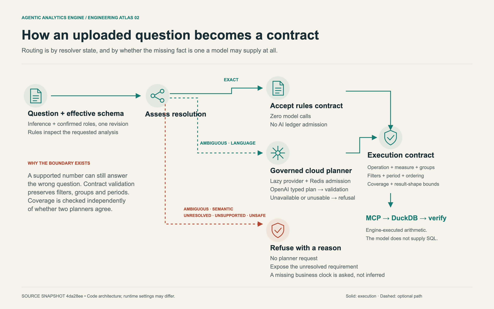
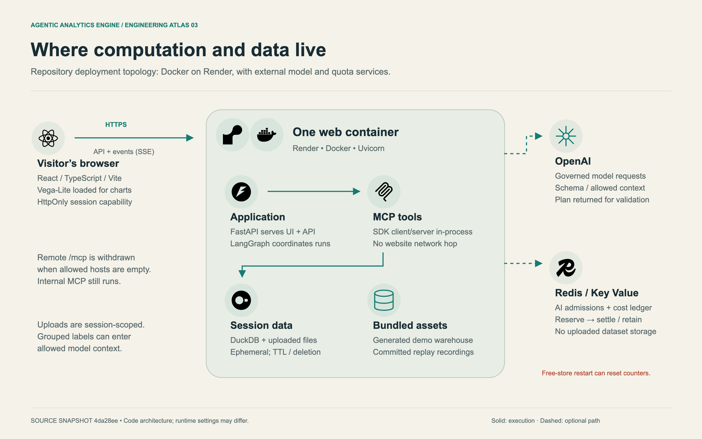

# Architecture atlas

Three complementary diagrams for the implemented product. They are deliberately
not literal call graphs: each is a readable map of one boundary that matters
when evaluating or changing the engine.

The SVGs are editable and embed the stack marks they display; PNGs are useful
for README previews and slide decks. Solid arrows are the primary path; dashed
arrows are conditional or deployment-dependent.

## 1. From question to inspectable answer

[Open SVG](01-end-to-end.svg) · [open PNG](01-end-to-end.png)

This is the complete reader-facing path: demo or upload, session admission,
local or governed planning, MCP/DuckDB computation, publication gates, and an
answer with tables, charts and provenance. It is a conceptual flow, not a
claim that every question uses every graph node.

## 2. Automatic governed planning

[Open SVG](02-governed-planning.svg) · [open PNG](02-governed-planning.png)

This isolates the default routing policy. An exactly resolved upload question
does not construct a cloud provider or consume AI admission.

**Not every ambiguity is delegable**, and the diagram now distinguishes the
two kinds. An ambiguity of *language*, meaning wording that did not say which
column filled a role, may use a typed AI planning proposal, locally
validated before a contract reaches execution. An ambiguity of *business
semantics* may not: when a table carries both `order_date` and
`signup_date`, which one defines "2024" is a fact about the business, not
about the sentence, so the engine asks rather than letting a model choose.
`AMBIGUOUS_PERIOD_SEMANTICS` is deliberately absent from
`AI_ELIGIBLE_ISSUES`, and `ai_eligible` requires every issue to be in that
allow-list.

An unsafe or unmappable request is refused with its reason.

Forced AI and the comparison screen are explicit audit paths; they are not
shown as an automatic fallback.

## 3. Runtime and data boundaries

[Open SVG](03-runtime-and-data.svg) · [open PNG](03-runtime-and-data.png)

This view separates the one Render/Docker application container from optional
external dependencies. The website's MCP client and server run in-process.
Uploaded data is ephemeral session state; the optional key-value store holds
admission and usage accounting, not uploaded files. The model boundary is
conditional and governed.

## Role-confirmation boundary

The three visual plates were audited before session-scoped role confirmation
was added. The current architecture includes this extra effective-schema
boundary, documented here rather than silently implying that the plates
depict it.

1. Raw inferred schema and session-scoped, revisioned confirmations form one
   effective schema.
2. The API schema inspector, planner, contract resolver and MCP tools consume
   that effective schema.
3. Each run pins one confirmation snapshot and carries its role evidence and
   schema revision into the planning audit.
4. A role-confirmation PATCH rejects stale revisions and refuses changes while
   the same session has an active run.

The confirmation changes only an ambiguous field to **quantity** or
**category**. It is validated server-side, scoped to one session, not written
to durable user state, and cannot relabel completed evidence. See
[ADR 0007](../adr/0007-session-scoped-role-confirmation.md).

## Source map

| Diagram claim | Implementation |
| --- | --- |
| React, TypeScript, Vite and Vega-Lite | web/package.json and web/src |
| FastAPI, sessions, uploads and SSE | src/agentic_analytics/api/app.py |
| Workflow, upload fast path and publication | src/agentic_analytics/graph |
| Automatic routing and lazy planner creation | src/agentic_analytics/agents/analyst.py and ADR 0005 |
| Typed contract compiler | src/agentic_analytics/analytics/upload_plan.py |
| Presentation contract and evidence-bound prose | src/agentic_analytics/presentation and ADR 0004 |
| MCP client/server and in-process transport | src/agentic_analytics/mcp_layer |
| Guarded DuckDB execution | analytics/execute.py and warehouse/sqlguard.py |
| Governed cloud accounting | src/agentic_analytics/llm |
| Effective schema and role-confirmation provenance | analytics/semantic.py, warehouse/session.py and ADR 0007 |
| Container and deployment boundary | Dockerfile and render.yaml |

## Provenance and icon attribution

All three diagrams were re-audited against source snapshot `077fc70`, which
is the commit their footers name. The audit read each text node in the
artwork and found the call site behind it; what it checked is listed under
[What the source snapshot means](#what-the-source-snapshot-means). This
README still adds the later role-confirmation boundary in prose rather than
backdating it into the artwork.

Brand marks in the embedded SVGs are from Simple Icons. Their source URLs and
attribution are recorded in [assets/SOURCES.txt](assets/SOURCES.txt). The
OpenAI model symbol and line icons are original; the diagrams do not claim an
official OpenAI logo or a separate hosted MCP service.

For the detailed architecture and its invariants, read
[ARCHITECTURE.md](../ARCHITECTURE.md). For what has actually been measured,
read the release evidence rather than treating a diagram as proof.

## What the source snapshot means

Each diagram's footer names the commit its claims were checked against --
currently `077fc70`. The text in these diagrams was verified against
implementation call sites at that revision, not against intent. When the
architecture moves, the snapshot and the claim move together or the diagram
is wrong in a way no test will catch.

Nothing in CI reads these diagrams, so the snapshot is only worth the audit
behind it. What the `077fc70` audit resolved, diagram by diagram:

**01, from dataset to an inspectable answer.** The five operations in
"Resolved upload aggregate" are the set `_is_canonical_upload_aggregate`
admits in `graph/build.py`, literally and in full: `count`, `sum`,
`average`, `trend`, `rank`. `profile` is the sixth upload operation and is
deliberately *not* in that set, so a profile question routes to
`plan_analysis`, the "Other analysis paths" box, exactly as drawn. The
node chain in that box is the graph's own: `plan_analysis`,
`analysis_worker`, `aggregate_results`, `critique_findings`,
`followup_round`, `build_visualizations`, `write_report`,
`verify_publication`. "Build SHA on health, config and runs" is all three:
`api/models.py` carries it on the health and config models and
`api/runs.py` on the run. `AnalysisPresentation` is a `Strict` model in
`presentation/schemas.py`.

**02, how an uploaded question becomes a contract.** The five routing
states are `ResolutionState` in `analytics/resolution.py`: `EXACT`,
`AMBIGUOUS`, `UNRESOLVED`, `UNSUPPORTED`, `UNSAFE`. The split the diagram
draws between "AMBIGUOUS · LANGUAGE" and "AMBIGUOUS · SEMANTIC" is
`AI_ELIGIBLE_ISSUES`, which holds the four wording ambiguities a planner
may settle and excludes `AMBIGUOUS_PERIOD_SEMANTICS`. That exclusion is
what "a missing business clock is asked, not inferred" names, and
`ai_eligible` additionally requires the state to be `AMBIGUOUS` at all --
so "UNRESOLVED · UNSUPPORTED · UNSAFE → no planner request" holds by
construction.

**03, where computation and data live.** The ledger verbs are
`CostLedger.reserve` and `.settle` in `llm/ledger.py`; "retain" is
`.abandon`, which deliberately leaves a reservation charged rather than
refunding it. "Remote /mcp is withdrawn when allowed hosts are empty" is
`_mcp_transport_security` in `api/app.py`: an empty allow-list yields no
endpoint and a 503, and CI boots a container *with* an allow-list to show
the configured case still serves. The in-process transport is unaffected,
which is why the same diagram can say the website makes no network hop.
